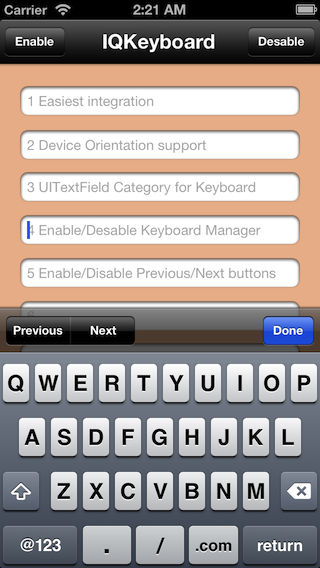
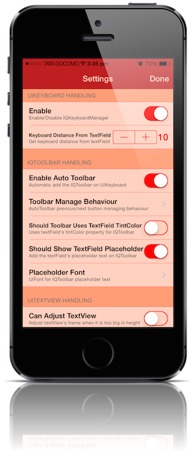
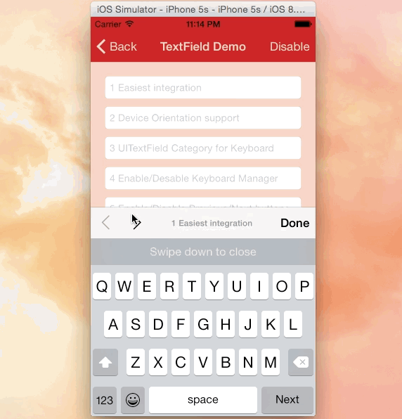
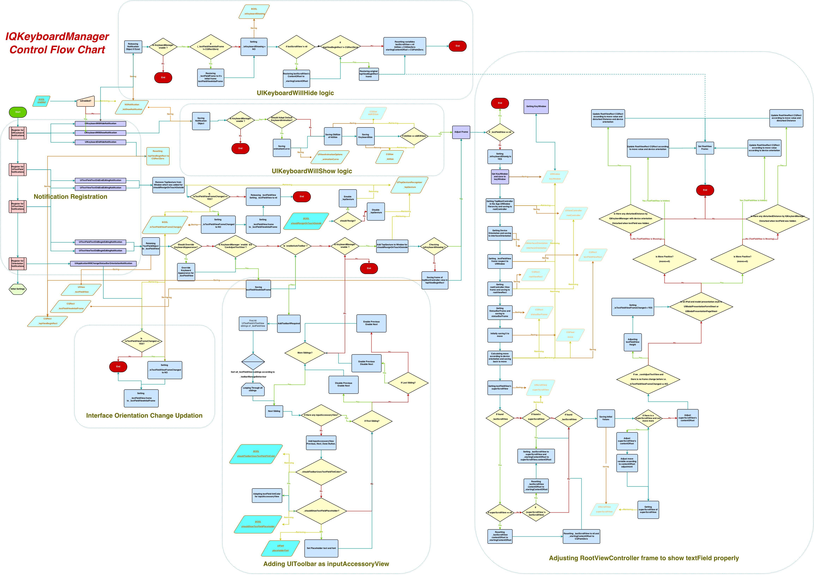

<p align="center">
  
</p>
<H1 align="center">IQKeyboardManager</H1>

Often while developing an app, We ran into an issues where the iPhone keyboard slide up and cover the `UITextField/UITextView`. `IQKeyboardManager` allows you to prevent issues of the keyboard sliding up and cover `UITextField/UITextView` without needing you to enter any code and no additional setup required. To use `IQKeyboardManager` you simply need to add source files to your project.

####Key Features

1) **CODELESS**, Zero Line Of Code`

2) `Works Automatically`

3) `No More UIScrollView`

4) `No More Subclasses`

5) `No More Manual Work`

6) `No More #imports`

`IQKeyboardManager` works on all orientations, and with the toolbar. There are also nice optional features allowing you to customize the distance from the text field, add the next/previous done button as a keyboard UIToolbar, play sounds when the user navigations through the form and more.

## Screenshot
[](http://youtu.be/6nhLw6hju2A)
[](http://youtu.be/6nhLw6hju2A)

## GIF animation
[](http://youtu.be/6nhLw6hju2A)

## Video

<a href="http://youtu.be/WAYc2Qj-OQg" target="_blank"></a>

## Requirements

#### IQKeyboardManager:-

Minimum iOS Target: iOS 5.0

Minimum Xcode Version: Xcode 5.0

#### Demo Project:-

Minimum Xcode Version: Xcode 6.0


Installation
==========================

#### Cocoapod Method:-

IQKeyboardManager is available through [CocoaPods](http://cocoapods.org), to install
it simply add the following line to your Podfile: ([#9](https://github.com/hackiftekhar/IQKeyboardManager/issues/9))

    pod 'IQKeyboardManager'

#### Source Code Method:-

Just ***drag and drop*** `IQKeyBoardManager` directory from demo project to your project. That's it.

## Known Issues:-


####1) Keyboard does not appear in iOS Simulator ([#62](https://github.com/hackiftekhar/IQKeyboardManager/issues/62), [#72](https://github.com/hackiftekhar/IQKeyboardManager/issues/72), [#75](https://github.com/hackiftekhar/IQKeyboardManager/issues/75), [#90](https://github.com/hackiftekhar/IQKeyboardManager/issues/90), [#100](https://github.com/hackiftekhar/IQKeyboardManager/issues/100))
     
If keyboard does not appear in iOS Simulator and only toolbar is appearing over it (if enableAutoToolbar = YES), then check this setting
     
***Xcode 6:-*** Goto ***iOS Simulator->Menu->Hardware->Keyboard->Connect Hardware Keyboard***, and deselect that.

***Xcode 5 and earlier:-*** Goto ***iOS Simulator->Menu->Hardware->Simulate Hardware Keyboard***, and deselect that.
    
####2) setEnable = NO doesn't disable automatic UIToolbar ([#117](https://github.com/hackiftekhar/IQKeyboardManager/issues/117), [#136](https://github.com/hackiftekhar/IQKeyboardManager/issues/136), [#147](https://github.com/hackiftekhar/IQKeyboardManager/issues/147))

If you set ***[[IQKeyboardManager sharedManager] setEnable:NO]*** and still automatic toolbar appears on textFields? Probably you haven't heard about ***@property enableAutoToolbar***.

***@property enable :*** It enable/disable managing distance between keyboard and textField, and doesn't affect autoToolbar feature.

***@property enableAutoToolbar :*** It enable/disable automatic creation of toolbar, please set enableAutoToolbar to NO if you don't want to add automatic toolbar.

####3) Swift version crashes in Release Mode ([#111](https://github.com/hackiftekhar/IQKeyboardManager/issues/111))

It may be compiler issue when compiler tries to optimize Code for best performance and compiler changes something in the middle which is not expected. Changing **Optimization Level** in Build Settings solve the problem.

**Workdaround:** Goto ***Target->Build Settings->Code Generation->Optimization Level***, and set it to ***None[-O0]***.([StackOverflow](http://stackoverflow.com/questions/3327981/app-runs-as-debug-but-crashes-as-release))


Manual Management:-
---

#### UINavigationBar:-

  If you don't want to hide the default UINavigationBar of UINavigationController when keyboardManager slides up the view, then just change the UIView class to UIScrollView from the storyboard or xib.([#21](https://github.com/hackiftekhar/IQKeyboardManager/issues/21), [#24](https://github.com/hackiftekhar/IQKeyboardManager/issues/24))


  If you are not using storyboard or xib and creating your view programmatically. Then you need to override '-(void)loadView' method of UIViewController, and need to set an UIScrollView instance to self.view.

    -(void)loadView
    {
        UIScrollView *scrollView = [[UIScrollView alloc] initWithFrame:[[UIScreen mainScreen] bounds]];
        self.view = scrollView;
    }
 
#### Disable for a ViewController:-

 If you would like to disable `IQKeyboardManager` for a particular ViewController then you should disable IQKeyboardManager on `ViewDidAppear` and again enable it on `ViewWillDisappear`.

    #import "IQKeyboardManager.h"
    @implementation ExampleViewController
    {
        BOOL _wasKeyboardManagerEnabled;
    }
    
    -(void)viewDidAppear:(BOOL)animated
    {
        [super viewDidAppear:animated];
        _wasKeyboardManagerEnabled = [[IQKeyboardManager sharedManager] isEnabled];
        [[IQKeyboardManager sharedManager] setEnable:NO];
    }

    -(void)viewWillDisappear:(BOOL)animated
    {
        [super viewWillDisappear:animated];
        [[IQKeyboardManager sharedManager] setEnable:_wasKeyboardManagerEnabled];
    }

    @end


#### Keyboard Return Key Handling:-
  If you would like to implement keyboard **Return Key** as **Next/Done** button, then you can use **IQKeyboardReturnKeyHandler**.([#38](https://github.com/hackiftekhar/IQKeyboardManager/issues/38), [#63](https://github.com/hackiftekhar/IQKeyboardManager/issues/63))
  
  1) Create an instance variable of `IQKeyboardReturnKeyHandler` and instantiate it in `viewDidLoad` with ViewController object like this:-
  
```
@implementation ViewController
{
    IQKeyboardReturnKeyHandler *returnKeyHandler;
}

- (void)viewDidLoad
{
    [super viewDidLoad];
    
    returnKeyHandler = [[IQKeyboardReturnKeyHandler alloc] initWithViewController:self];
}
```
   It assign all the responderView delegates to self, and change keybord Return Key to Next key.

2) set instance variable to nil in `dealloc` method.

```
-(void)dealloc
{
    returnKeyHandler = nil;
}
```


#### UIToolbar(IQToolbar):-

1) If you don't want to add automatic toolbar over keyboard for a specific textField then you should add a UIView as it's toolbar like this:-([#89](https://github.com/hackiftekhar/IQKeyboardManager/issues/89))
```
textField.inputAccessoryView = [[UIView alloc] init];
```

2) If you need your own control over the previous/next/done button then you should use the UIView category methods to add toolbar over your textField. The UIView category methods are defined in `IQUIView+IQKeyboardToolbar.h` file. You can use them like this:-([#40](https://github.com/hackiftekhar/IQKeyboardManager/issues/40))
```
-(void)viewDidLoad
{
    [super viewDidLoad];
    
    //Adding done button for textField1
    [textField1 addDoneOnKeyboardWithTarget:self action:@selector(doneAction:)];
    
    //Adding previous/next/done button for textField2
    [textField2 addPreviousNextDoneOnKeyboardWithTarget:self previousAction:@selector(previousAction:) nextAction:@selector(nextAction:) doneAction:@selector(doneAction:)];
    
    //Adding cancel/done button for textField3
    [textField3 addCancelDoneOnKeyboardWithTarget:self cancelAction:@selector(cancelAction:) doneAction:@selector(doneAction:)];
}

/*!	previousAction. */
-(void)previousAction:(id)button
{
    //previousAction
}

/*!	nextAction. */
-(void)nextAction:(id)button
{
    //nextAction
}

/*!	doneAction. */
-(void)doneAction:(UIBarButtonItem*)barButton
{
    //doneAction
}

/*!	cancelAction. */
-(void)cancelAction:(UIBarButtonItem*)barButton
{
    //cancelAction
}

```

#### Doing custom work on textField with returning NO in `textFieldShouldBeginEditing:` delegate:-

Generally if developer need to perform some custom task on a particular textField click, then usually developer write their custom code inside ***textFieldShouldBeginEditing:*** and returning NO for that textField. But if you are using IQKeyboardManager, then IQKeyboardManager also asks textField to recognize it can become first responder or not using ***canBecomeFirstResponder*** in `IQUIView+Hierarchy` category, and textField asks it's delegate to respond from `textFieldShouldBeginEditing:`, so this method is called for each textField everytime when a textField becomeFirstResponder. Unintentionally custom code runs multiple times even when we do not touch the textField to become it as first responder. To overcome this situation please use ***isAskingCanBecomeFirstResponder*** BOOL property to check that the delegate is called by IQKeyboardManager or not. ([#88](https://github.com/hackiftekhar/IQKeyboardManager/issues/88))

1) You may need to import `IQUIView+Hierarchy` category
```
#import "IQUIView+Hierarchy.h"
```

2) check for ***isAskingCanBecomeFirstResponder*** in `textFieldShouldBeginEditing:` delegate.

```
-(BOOL)textFieldShouldBeginEditing:(UITextField *)textField
{
    if (textField == customWorkTextField)
    {
        if (textField.isAskingCanBecomeFirstResponder == NO)
        {
            //Do your work on tapping textField.
            [[[UIAlertView alloc] initWithTitle:@"IQKeyboardManager" message:@"Do your custom work here" delegate:nil cancelButtonTitle:@"OK" otherButtonTitles:nil, nil] show];
        }

        return NO;
    }
    else    return YES;
}
```

## Control Flow Diagram
[](https://raw.githubusercontent.com/hackiftekhar/IQKeyboardManager/master/KeyboardTextFieldDemo/Screenshot/IQKeyboardManagerCFD.jpg)


##Properties and functions usage:-


####UIKeyboard handling

***+(instancetype)sharedManager :***
Returns the default singleton instance.

***@property BOOL enable :***
Use this to enable/disable managing distance between keyboard & textField/textView).

***@property CGFloat keyboardDistanceFromTextField :***
Set Distance between keyboard & textField. Can't be less than zero. Default is 10.

***@property BOOL preventShowingBottomBlankSpace :***
Prevent to show bottom blanck area when keyboard slide up the view. Default is YES. ([#93](https://github.com/hackiftekhar/IQKeyboardManager/issues/93)).

####IQToolbar handling

***@property BOOL enableAutoToolbar :***
Enable autoToolbar behaviour. If It is set to NO. You have to manually create UIToolbar for keyboard. Default is YES.

***@property IQAutoToolbarManageBehaviour toolbarManageBehaviour :***
Setting toolbar behaviour to IQAutoToolbarBySubviews to manage previous/next according to UITextField's hierarchy in it's SuperView. Set it to IQAutoToolbarByTag to manage previous/next according to UITextField's tag property in increasing order. Default is IQAutoToolbarBySubviews.

***@property  BOOL shouldToolbarUsesTextFieldTintColor :***
If YES, then uses textField's tintColor property for IQToolbar, otherwise tintColor is black. Default is NO. ([#27](https://github.com/hackiftekhar/IQKeyboardManager/issues/27))

***@property BOOL shouldShowTextFieldPlaceholder :***
If YES, then it add the textField's placeholder text on IQToolbar. Default is YES. ([#27](https://github.com/hackiftekhar/IQKeyboardManager/issues/27))

***@property UIFont *placeholderFont :***
placeholder Font. Default is nil. ([#27](https://github.com/hackiftekhar/IQKeyboardManager/issues/27))


####UITextView handling

***@property BOOL canAdjustTextView :***
Giving permission to modify TextView's frame. Adjust textView's frame when it is too big in height. Default is NO. ([#30](https://github.com/hackiftekhar/IQKeyboardManager/issues/30))

***@property BOOL shouldFixTextViewClip :***
Adjust textView's contentInset to fix fix for iOS 7.0.x -([#Stackoverflow](http://stackoverflow.com/questions/18966675/uitextview-in-ios7-clips-the-last-line-of-text-string)). Default is YES.


####UIKeyboard Appearance overriding

***@property BOOL overrideKeyboardAppearance :***
Override the keyboardAppearance for all textField/textView. Default is NO.

***@property UIKeyboardAppearance keyboardAppearance :***
If overrideKeyboardAppearance is YES, then all the textField keyboardAppearance is set using this property.


####UITextField/UITextView Resign handling

***@property BOOL shouldResignOnTouchOutside :***
Resign textField if touched outside of UITextField/UITextView. ([#14](https://github.com/hackiftekhar/IQKeyboardManager/issues/14))

***-(void)resignFirstResponder :***
Resigns currently first responder field.

####UISound handling

***@property BOOL shouldPlayInputClicks :***
If YES, then it plays inputClick sound on next/previous/done click. Default is NO.


####UIAnimation handling

***@property BOOL shouldAdoptDefaultKeyboardAnimation :***
If YES, then uses keyboard default animation curve style to move view, otherwise uses UIViewAnimationOptionCurveEaseOut animation style. Default is YES.


## Feature:-

 1) Support Device Orientation.
 
 2) Enable/Disable Keyboard Manager when needed with `enable` boolean.

 3) Easiest integration.

 4) AutoHandle UIToolbar as a accessoryInputView of textField/textView with `enableAutoToolbar` boolean.

 5) AutoHandle UIToolbar can be manged by superview's hierarchy or can be managed by tag property of textField/textView using `toolbarManageBehaviour` enum.

 6) `UIView` Category for easily adding Next/Previous and Done button as Keyboard UIToolBar, even automatic with `enableAutoToolbar` boolean.

 7) Enable/Disable Next/Previous buttons with Category methods, even automatic with `enableAutoToolbar` boolean.

 8) Set keyboard distance from textFields using `keyboardDistanceFromTextField`.
 
 9) Resign keyboard on touching outside using `shouldResignOnTouchOutside`.
 
 10) Manage UITextView's frame when it's hight is too large to fit on screen with `canAdjustTextView` boolean.
 
 11) Can manage `UITextField/UITextView` inside `UITableView/UIScrollView`.
 
 12) Can play input sound on Next/Previous/Done click.

LICENSE
---
Distributed under the MIT License.

Contributions
---
Any contribution is more than welcome! You can contribute through pull requests and issues on GitHub.

Author
---
If you wish to contact me, email at: hack.iftekhar@gmail.com

